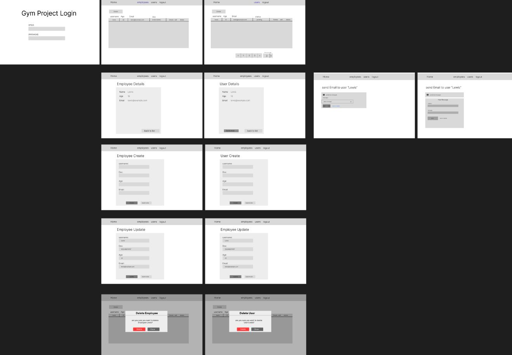
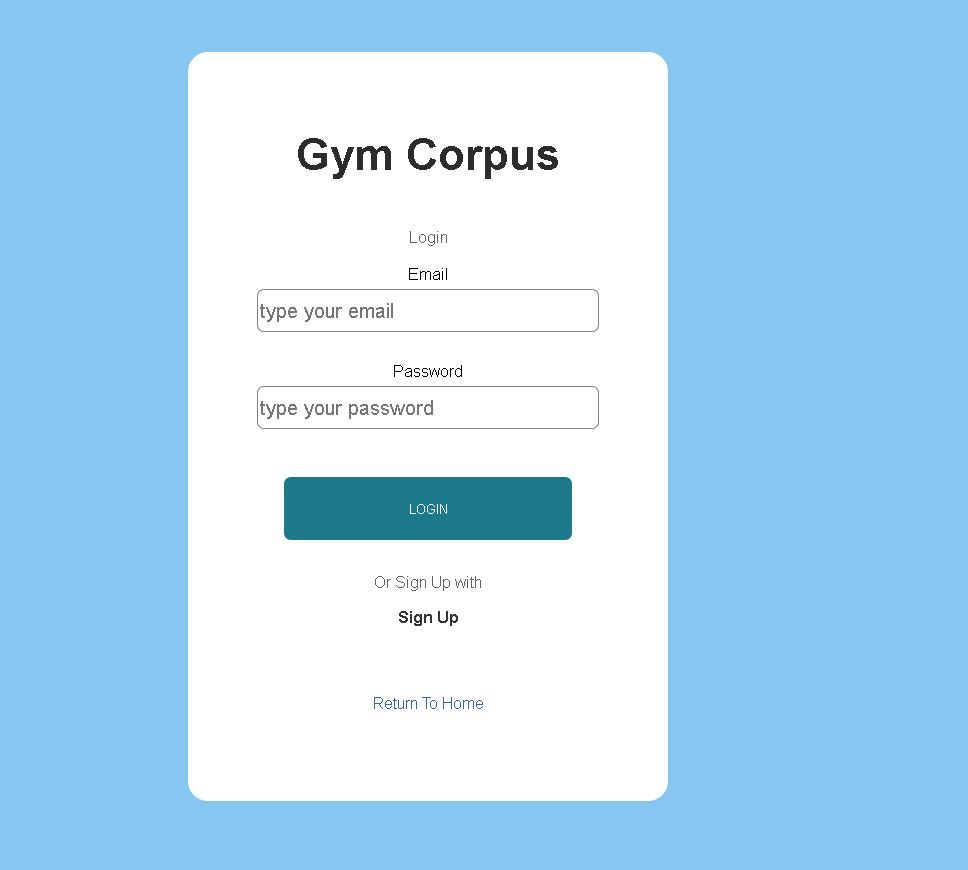
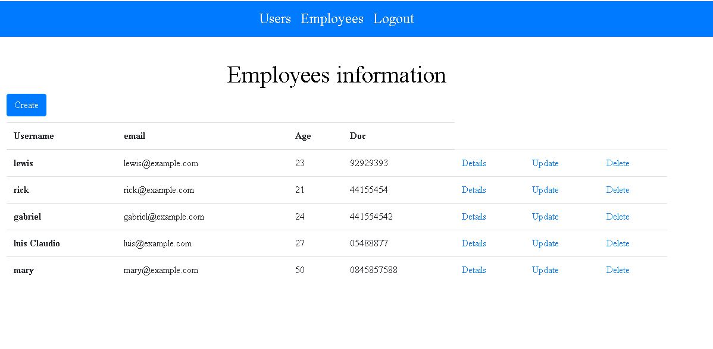
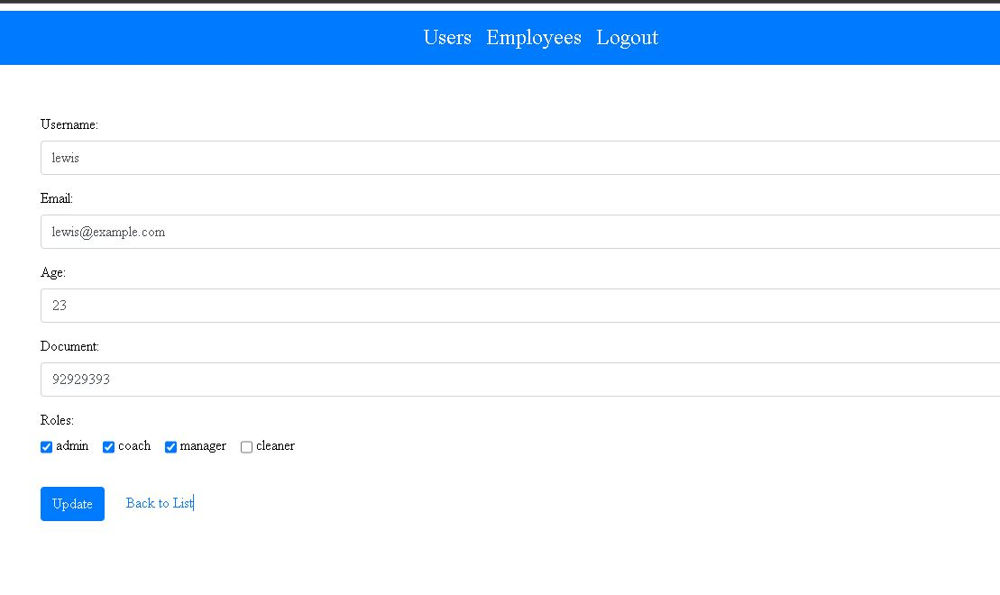
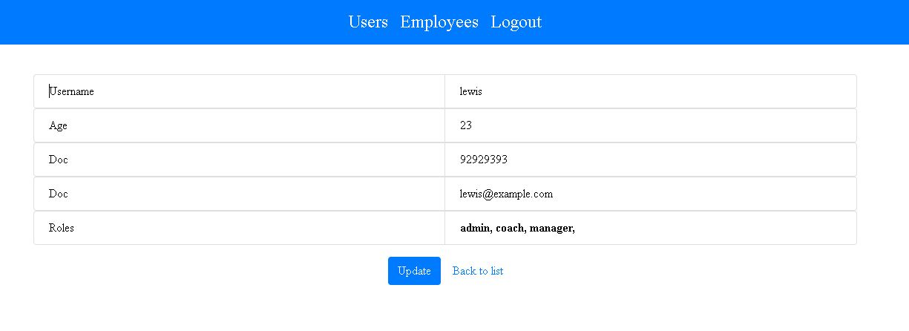
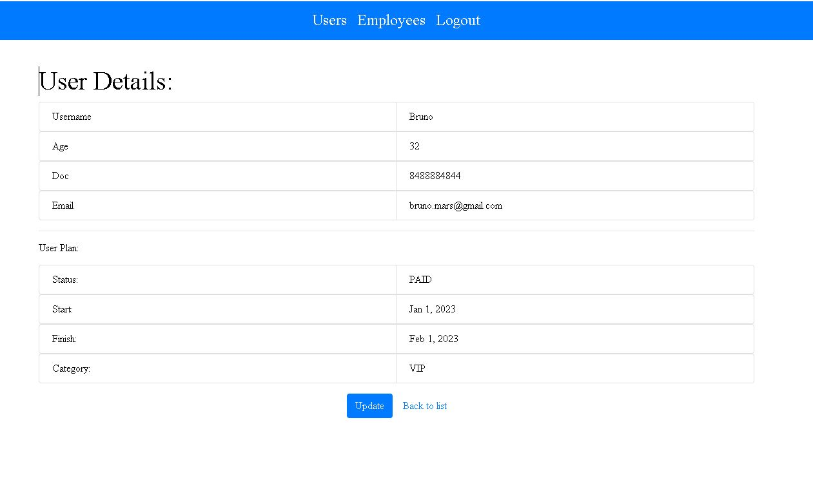
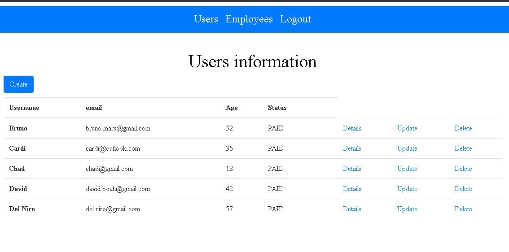
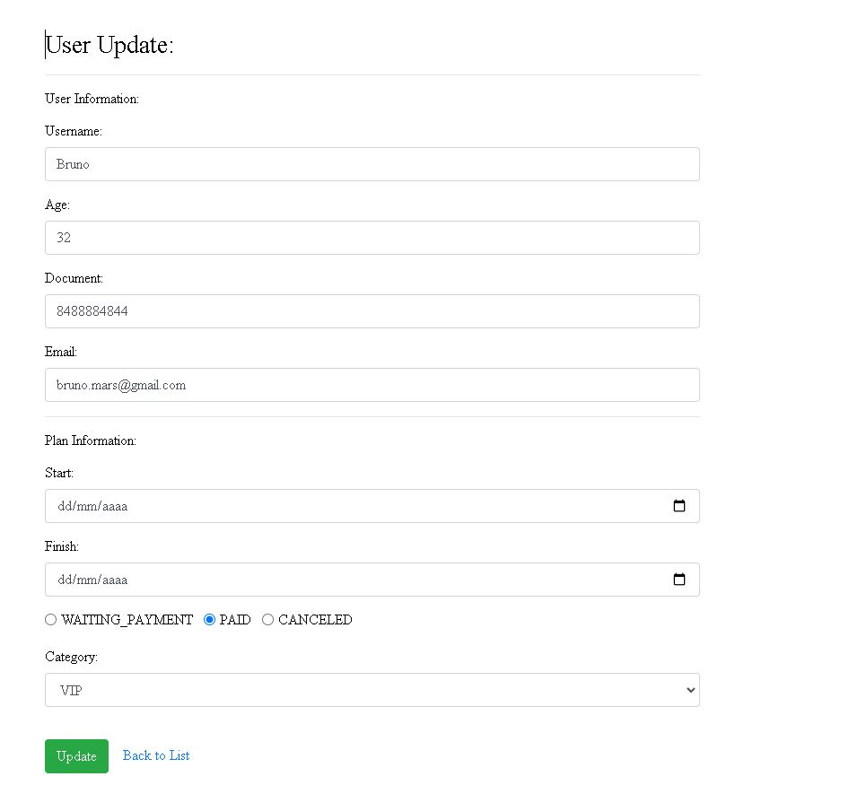
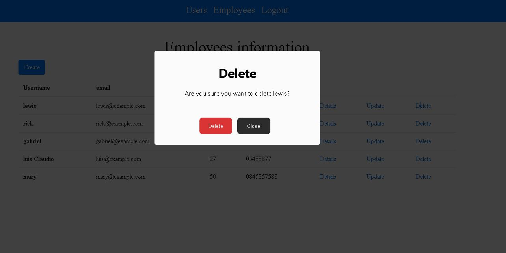

## 🖼 Academia "Gym Corpus" Dashboard Gestão de clientes  

 
<h2>Description English</h2>

This Freelancer project for a local gym where you can manage clients and users
where you can easily change users' debt status as well as plan category.
  My expertise in creating a secure infrastructure with JWT,
scale microservices and apply TDD with unit and integration testing
  ensure the system is robust and reliable.

<h2>Descrição Português</h2>

Este projeto como Freelancer para uma academia local onde você pode gerenciar clientes e usuários
onde você pode facilmente mudar o status dos usuários em débito, bem como a categoria do plano.
 Minha expertise em criar uma infraestrutura segura com JWT, 
escalar microsserviços e aplicar TDD com testes unitários e de integração
 garantem que o sistema seja robusto e confiável.

 
<h2>How to Run</h1>

in the Root file go to the terminal and add "docker-compose up" (you need to have Docker and Java install you your machine)
then will generate the docker containers and you'll need to create an Employee in the container DB 
db-employee, (you can use the dashboard to postgreSQL PgAdmin) and configure the server then will automatically
will create the database tables after that you'll need to create a new Employee you can use this SQL below

 
INSERT INTO public.tb_employee(
   id,username, age, doc, email, password)
   VALUES ('31c4bed2-4b31-417e-b77e-bd88a4f96ae8','felipe', 22, '299229292223', 'felipe.santos@gmail.com', 'Secret@123');

After that Just follow the video gift below showing all the project structure, Enjoy :)

 
## 🚀 Tech Usada 
 
- Spring Boot 
- Spring Cloud Microserviços  
- HTML and CSS typescript 
- HATEOAS 
- Clean Code 
- Angular 2 
-   Bootstrap 
-   Unit testing, mocking and Integration Tests
-   MySQL  
-   Swagger  
-   Docker  
-  Authentication and  Authorization with Token JWT   
-   PostgreSQL  
-   Docker  
-   Rest   
-    JUnit, Mockito, MockMvc  
-    CI CD com GitHub Actions 

 

## 🖼 Screenshot APPLICATION SCREENS  

Whole application - And How to RUN -  click below to the run video

 
 

Infrastructure Frontend

 
 

Login Page

 
 

chat-screen-page

 
 

Employee Update

 
 

Employee Details

 
 

Employee Delete

 
 

User Details

 
 

User List

 
 

User Update

 
 

User Delete

 
 

## Linkedin Below - Linkedin ABaixo

<h4 align="center">
   Created by   <a href="https://www.linkedin.com/in/luiz-carlos-b50693173/" target="_blank"> Luiz Carlos </a>
</h4>

</html>
