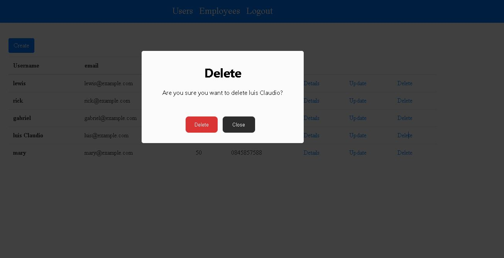

## 🖼 Academia "Gym Corpus" Dashboard Gestão de clientes  

 
<h2>Description English</h2>

I'm developing this project as a Freelancer to a local Gym where you can manage Customers and Users
Like changing the Status, if the User is in debit, or change the Plan Category, i learnt i lot as creating 
an infrastructure adding Security with JWT, escalating Microservices, add TDD with Unit and Integration Tests

<h2>Descrição Português</h2>

Estou desenvolvendo este projeto como Freelancer para uma academia local onde você pode gerenciar clientes e usuários
Como mudar o Status, se o Usuário está em débito, ou mudar a Categoria do Plano, aprendi  muito como criar
uma Infraestrutura,  adicionar segurança com JWT, escalar microsserviços, realizar TDD com Testes unitários,
Testes de Integração. 

 
## 🚀 Tech Usada 
 
- Spring Boot 
- Spring Cloud Microserviços  
- HTML and CSS typescript 
- HATEOAS 
- Clean Code 
- Angular 2 
-   Bootstrap 
-   Unit testing, mocking and Integration Tests
-   MySQL  
-   Swagger  
-   Docker  
-  Authentication and  Authorization with Token JWT   
-   PostgreSQL  
-   Docker  
-   Rest   
-    JUnit, Mockito, MockMvc  
-    CI CD com GitHub Actions 

 

## 🖼 Screenshot APPLICATION SCREENS  

Whole application click below to the run video

 
 

Login Page

 
 

chat-screen-page

 
 

Employee Update

 
 

Employee Details

 
 

Employee Delete

 
 

User Details

 
 

User List

 
 

User Update

 
 

User Delete

 
 

## Linkedin Below - Linkedin ABaixo

<h4 align="center">
   Created by   <a href="https://www.linkedin.com/in/luiz-carlos-b50693173/" target="_blank"> Luiz Carlos </a>
</h4>

</html>
